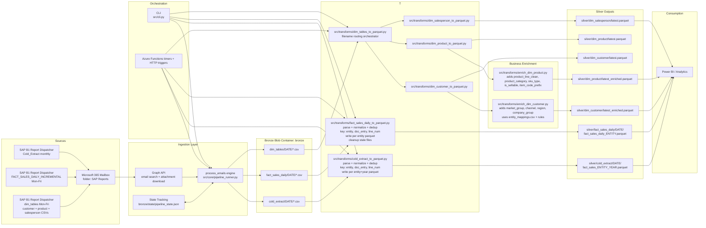
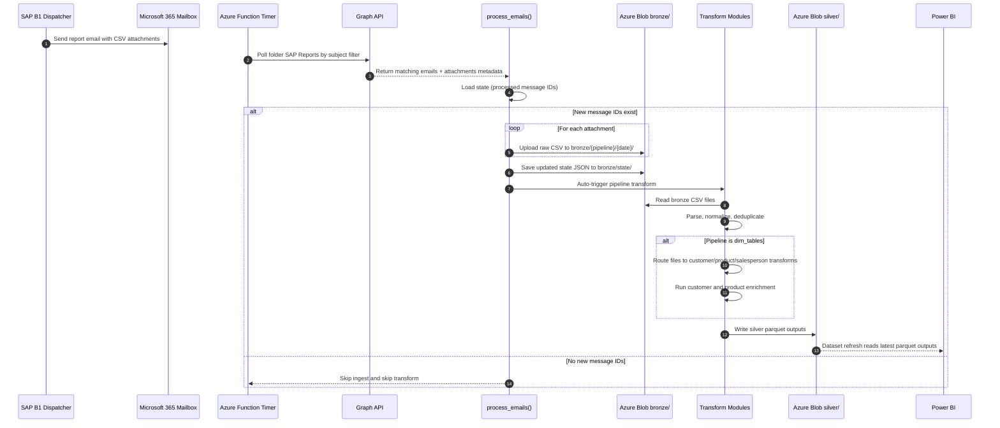

# QMS ETL Architecture

This page documents the current end-to-end ETL architecture for `etl_pipeline`, including sources, ingestion, transformations, enrichment, and silver-layer outputs consumed by analytics.

## End-to-End Data Flow

## Notes

- Bronze ingestion is state-tracked using per-pipeline JSON state blobs.
- `dim_tables` is a routed orchestrator that dispatches files to customer/product/salesperson transforms.
- Customer and product dimensions are enriched after `latest.parquet` is written, producing `latest_enriched.parquet`.
- The same core flow can be run from CLI (`src/cli.py`) or Azure Functions triggers (`azure_functions/function_app.py`).

## Technical Runtime Sequence

## Work To Be Done

The table below highlights delivery gaps for the target operating model.

| Priority | Area | Current Status | Work Required |
|---|---|---|---|
| P0 | Schema validation + dead-letter | Missing hard fail gate and alerting | Add required-column/type validation before silver writes; on failure, write payload to dead-letter prefix and send Teams/email alert. |
| P0 | ETL freshness trust | Missing explicit load timestamp column in outputs | Add `etl_load_timestamp` to fact and dim outputs and surface in Power BI header card. |
| P1 | Currency normalization | Not implemented | Add exchange-rates source keyed by date and currency/entity; compute normalized revenue field in fact transforms. |
| P1 | Externalized business mappings | Partial (customer has CSV, product is hardcoded) | Move product and remaining customer mapping rules into managed mapping files (SharePoint/Blob) with left-join in enrichment. |
| P1 | Actual vs budget grain | Not implemented | Build monthly `month_key` aggregate for actuals and ingest budget file at same grain for variance analysis. |
| P2 | Forecast/history snapshots | Partial (facts have dated snapshots, dims mostly latest) | Persist dated snapshots for dim latest and dim enriched outputs for point-in-time comparisons. |
| P2 | In-transit email security | Not implemented (plain CSV attachments) | Support password-protected ZIP attachments and load decryption secret from secure store. |
| P2 | Budget and planning ingestion | Not implemented | Add SharePoint/Blob budget pipeline and write curated silver/gold budget dataset. |

## Already In Place

- Multi-entity handling via `entity` column and per-entity silver outputs.
- Deduplication for fact pipelines on `(entity, doc_entry, line_num)`.
- Stateful email ingestion using Graph API + blob state files.
- Orchestrated dim routing (`dim_tables`) with enrichment for customer and product.

## DNR-72 Jira Draft

### Title

ETL Reliability Hardening: Validation, Dead-Letter, Alerting, and Freshness Timestamp

### Description

Implement a reliability and observability hardening pass across the ETL pipeline to ensure invalid inbound data cannot corrupt curated outputs, failures are surfaced immediately, and downstream consumers can verify data freshness from curated parquet outputs.

This work should add a schema validation gate before silver writes, introduce dead-letter handling for invalid files or runs, send configurable failure alerts for ingest and transform issues, and add a consistent UTC `etl_load_timestamp` to curated parquet outputs.

The goal is to make the current email-driven SAP ingestion model operationally safe without changing the existing pipeline topology or downstream consumption model.

### Acceptance Criteria

1. Required columns are validated before any silver write for all active pipelines.
2. Type checks exist for key fields including `doc_date`, `entity`, `doc_entry`, `line_num`, and `net_revenue` where applicable.
3. Invalid files or failed validation runs are written to a dead-letter location with machine-readable error metadata.
4. Silver outputs are not updated when validation fails.
5. Transform and ingest responses return actionable failure details.
6. Any ingest or transform failure triggers an alert.
7. Alert payload includes pipeline name, date, file name where available, failure reason, and environment.
8. Alert destination is configurable by environment variable.
9. Duplicate alerts for the same failed run are suppressed.
10. All curated latest and dated parquet outputs include `etl_load_timestamp`.
11. `etl_load_timestamp` is UTC and consistent across a single pipeline run.
12. Documentation explains how Power BI should surface freshness from `etl_load_timestamp`.

### Technical Notes

#### Current State

- Basic parser resilience already exists via multi-encoding and multi-separator parsing in the fact transforms.
- Failures currently accumulate in `stats["errors"]` and surface through logs or HTTP responses, but there is no active alerting layer.
- No explicit schema validation layer exists after parsing and before parquet writes.
- No dead-letter or quarantine path exists for invalid files.
- Curated outputs currently do not include a consistent ETL freshness timestamp.

#### Suggested Implementation Shape

- Add a shared validation module, for example `src/core/validation.py`, to enforce required columns, type checks, and key field constraints.
- Add a dead-letter helper, for example `src/core/dead_letter.py`, to persist invalid files and structured error metadata under a blob quarantine path.
- Add a lightweight alerting module, for example `src/core/alerting.py`, that evaluates run results and sends Teams or email notifications based on environment configuration.
- Generate a single UTC timestamp at transform entry and stamp all parquet outputs written by that run with `etl_load_timestamp`.

#### Likely File Touchpoints

- `src/core/pipeline_runner.py`
- `src/pipelines/config.py`
- `azure_functions/function_app.py`
- `src/transforms/cold_extract_to_parquet.py`
- `src/transforms/fact_sales_daily_to_parquet.py`
- `src/transforms/dim_tables_to_parquet.py`
- `src/transforms/dim_customer_to_parquet.py`
- `src/transforms/dim_product_to_parquet.py`
- `src/transforms/dim_salesperson_to_parquet.py`
- `src/transforms/enrich_dim_customer.py`
- `src/transforms/enrich_dim_product.py`
- `.env.template`
- `README.md`

#### Proposed Dead-Letter Contract

- Quarantine path: `bronze/dead_letter/YYYY-MM-DD/`
- Error registry: structured JSON payload with pipeline, file name, failure type, missing columns, type violations, and timestamp
- Result dict additions: `dead_letter_files`, `validation_errors`, and `data_quality_warnings`

#### Proposed Alerting Contract

- Alert on ingest failure, transform failure, and validation failure
- Configurable channel via environment variables
- Minimum payload: pipeline name, environment, run date, file name if known, failure summary
- Alert failure must not fail the ETL run itself

#### Proposed Freshness Contract

- Column name: `etl_load_timestamp`
- Value: UTC timestamp, constant across a single transform run
- Apply to fact outputs, dimension outputs, and enriched dimension outputs
- Power BI should display `MAX(etl_load_timestamp)` in a visible header card

### Out Of Scope

- Currency normalization and exchange-rate joins
- Budget or planning-data ingestion
- Externalizing product and customer business mappings to managed reference files
- Monthly actual-vs-budget normalization
- Dimension snapshot history expansion beyond any changes needed for timestamp coverage
- ZIP/password protection for inbound attachments
- Reworking the current Graph API plus Azure Functions ingestion architecture

### Estimate

- Suggested estimate: 5 to 8 engineering days
- Complexity: medium to large
- Delivery shape: one implementation ticket with explicit subtasks for validation, dead-letter handling, alerting, timestamping, and documentation

### Dependencies

- Azure Blob Storage access for dead-letter paths
- Environment configuration for alert routing in `.env.template`
- Decision on primary alerting channel: Teams, email, or both
- Agreement on validation strictness to avoid rejecting historically tolerated files
- Power BI consumer agreement on how `etl_load_timestamp` will be surfaced

### Suggested Subtasks

1. Add shared schema validation framework.
2. Add dead-letter blob handling and error registry payloads.
3. Add configurable alerting for ingest and transform failures.
4. Add `etl_load_timestamp` to fact outputs.
5. Add `etl_load_timestamp` to dimension and enriched outputs.
6. Update architecture and README documentation for operational use.
